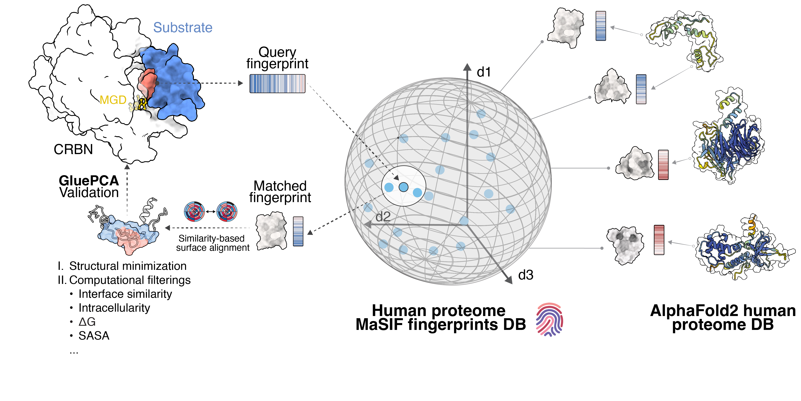

## _MaSIF-mimicry_ 

This repository contains code to perform the experiments in _Mapping the latent CRBN-molecular glue degrader interactome_

### Pipeline overview


## Table of Contents: 

- [System and hardware requirements](#system-and-hardware-requirements)
- [Step-by-step example](#step-by-step-example)
- [Configuring parameters](#configuring-parameters)
- [License](#license)
- [Reference](#reference)

## System and hardware requirements

MaSIF-mimicry has been tested on Linux. To run the mimicry pipeline, first clone the official MaSIF-mimicry repository and then clone this repository inside it. 
```
git clone https://github.com/LPDI-EPFL/masif_seed.git
cd masif_seed
git clone https://github.com/xiaosh9527/masif_seed_mimicry.git
```
The required the software for running MaSIF-mimicry is the same as listed in the MaSIF-seed repository, wioth the exception of python-igraph >= 0.9.6 which is required for pae_to_domain package.

## Requirements

MaSIF relies on external software/libraries to handle protein databank files and surface files, 
to compute chemical/geometric features and coordinates, and to perform neural network calculations. 
The following is the list of required libraries and programs, as well as the version on which it was tested (in parentheses).
* [Python](https://www.python.org/) (3.6)
* [reduce](http://kinemage.biochem.duke.edu/software/reduce.php) (3.23). To add protons to proteins. 
* [MSMS](http://mgltools.scripps.edu/packages/MSMS/) (2.6.1). To compute the surface of proteins. 
* [BioPython](https://github.com/biopython/biopython) (1.66). To parse PDB files. 
* [PyMesh](https://github.com/PyMesh/PyMesh) (0.1.14). To handle ply surface files, attributes, and to regularize meshes.
* PDB2PQR (2.1.1), multivalue, and [APBS](http://www.poissonboltzmann.org/) (1.5). These programs are necessary to compute electrostatics charges.
* [Open3D](https://github.com/IntelVCL/Open3D) (0.5.0.0). Mainly used for RANSAC alignment.
* [Tensorflow](https://www.tensorflow.org/) (1.9). Use to model, train, and evaluate the actual neural networks. Models were trained and evaluated on a NVIDIA Tesla K40 GPU.
* [Pymol](https://pymol.org/2/) (2.5.0). This optional program allows one to visualize surface files.

## Installation with Docker

## Step-by-step example

To reproduce the experiments in the paper, the entire datasets for the human proteome consume several terabytes. We will test MaSIF-mimicry using one example between mTOR and Ikaros.
Here, we provide an example to process mTOR structures into individual structural domains by using pae_to_domain to split the AlphaFold models based on a PAE cutoff of 15 Å.

```
cd masif/data/
mkdir masif_human_proteome
cd masif_human_proteome
git clone https://github.com/tristanic/pae_to_domains.git
sh ../../../masif_mimicry/scripts/process_af_model.sh P42345
```

This will generate truncated structural domains from the original full-length AF model. The same process can be applied to rest of the proteome proteins to generate a MaSIF human proteome database. 
Below, we use one of the mTOR domains as an example. In case where multiple domains are generated, the same procedure must be applied to all. Now precompute the features for this protein domain, including the geodesic coordinates: 

```
./data_precompute_patches_one.sh P42345-F1-dom-01_A
```

Finally, compute the MaSIF-site prediction and the MaSIF-search descriptors. 

```
./predict_site.sh P42345-F1-dom-01_A
./compute_descriptors.sh P42345-F1-dom-01_A
```

Once the site predictions and descriptors on `P42345-F1-dom-01_A` have been computed, we 
can focus on the target. 

```
cd ../../../
cd masif_mimicry/data/test/
```

The features, MaSIF-site and MaSIF-search descriptors must be computed as well for the target, 
as well as a surface with per-vertex coloring. 

```
./data_precompute_patches_one.sh 6h0g_C_B ./input/6h0g.pdb
./predict_site.sh 6h0g_C_B
./compute_descriptors.sh 6h0g_C_B
```

Finally, run the script to search for a surface patch in mTOR that mimics the ZNF692 degron interface. 

```
./run.sh
```

## Configuring parameters

Some parameters may improve your search:

The main criterion for speed is the 'descriptor distance cutoff'. This cutoff determines which fingerprints are further considered and which are completely discarded. The lower the value, the faster the search (and the higher the number of false negatives):
```
# Score cutoffs -- these are empirical values; if they are too loose, then you get a lot of results.
# Descriptor distance cutoff for the patch. All scores below this value are accepted for further processing.
desc_dist_cutoff = 1.5 # Recommended values: [1.5-2.0] (lower is stricter)
```

Another significant cutoff value is the interface cutoff. All patches are scored due to their interface propensity. One can assume that during the search, we want to find peptides with a high interface cutoff. You can lower this value to increase the number of candidates:

```
# Interface cutoff value: all patches with a score below this value are discarded. For the degron interface, as MaSIF has not been trained with ternary complexes, we recommend an iface cutoff at 0.0
iface_cutoff = 0.0 # Recommended values: [0.0-0.95] range (higher is stricter)
```

Finally, for the normalized desc_dist_score (i.e., MaSIF mimicry score), we recommend a cut-off at 0.4:

```
# MaSIF mimicry score cutoff - Discard anything below this score
desc_dist_score_cutoff = 0.4 # Recommended values: [0.35-0.5] (higher is stricter)
```

The number of sites to target in the protein (generally 1 should be fine):

```
# Number of sites to target in the protein
num_sites = 10
```

Due to the large size of the proteome dataset, it is possible to perform searches with downsampling and select every k patches:

```
# Downsampling every 3 patches
downsample = 3
```

## License

MaSIF-mimicry is released under an [Apache v2.0 license](LICENSE).

## Reference
If you use this code, please use the bibtex entry in [citation.bib](citation.bib)


