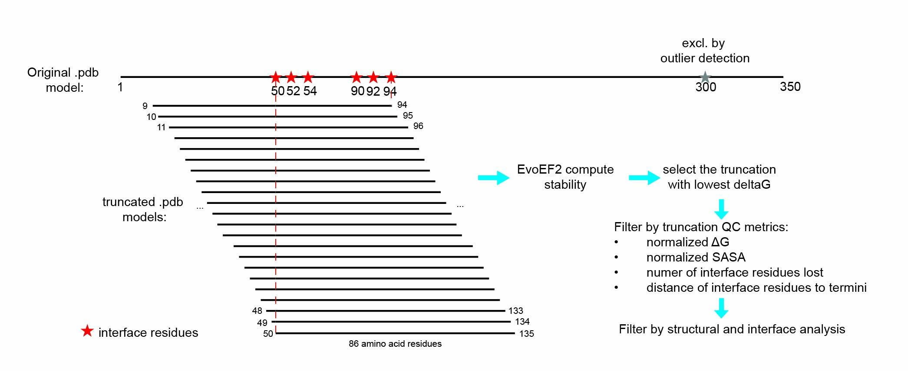

# MaSIF Mimicry Postprocessing and Truncation Workflow

This repository contains a comprehensive pipeline for postprocessing and analyzing MaSIF surface mimicry search results. 
The workflow processes protein binder structures through multiple stages: postprocessing metrics calculation, optimal truncation, and filtering to identify high-quality binding candidates.

## Overview



The pipeline consists of several interconnected components:

1. **Postprocessing**: Calculate structural and interface metrics for binder structures
2. **Truncation**: Find optimal truncation windows using EvoEF2 folding energy calculations
3. **Filtering**: Apply quality filters based on computed metrics
4. **Sequence retrieval**: Fetch FASTA sequences for final candidates

## Usage Instructions

1. **Setup**: Edit `scripts/bonsai_scripts/python/config.yaml` with your system paths and executables

2. **Configure Workflow**: Edit parameters in `scripts/bonsai_scripts/postprocessing_truncation_workflow_apptainer.sh`:
   - Set `WORK_DIR`, `TARGET_PDB_PATH`
   - Configure `LIGAND` and `TRUNC_LENGTH`

4. **Run Pipeline**: Launch the workflow (it submits SLURM jobs internally):
   ```
   bash scripts/bonsai_scripts/postprocessing_truncation_workflow_apptainer.sh
   ```


## Pre-requisites

- **DeepTMHMM Database**: Pre-computed predictions for human proteome sequences using DeepTMHMM (https://www.biorxiv.org/content/10.1101/2022.04.08.487609v1) 
- **STRIDE**: Executable for secondary structure calculation
- **EvoEF2**: Executable for protein folding free energy calculation
- **SLURM**: Job scheduler for parallel processing
- **Python packages**: BioPython, RDKit, pandas, numpy, scikit-image, networkx

## Output Files

- `postprocessed_scores.csv`: Metrics for original binder structures
- `truncated_scores.csv`: Metrics for both original and truncated structures
- `proc_trunc_86_6H0F_C_B_250325_filtered.csv`: Quality-filtered results
- `proc_trunc_86_6H0F_C_B_250325_filtered_seq.csv`: Final results with FASTA sequences 

##

# Details of each component of the workflow:


## Workflow Components

### 1. Main Workflow Script: `postprocessing_truncation_workflow_apptainer.sh`

This is the master script that orchestrates the entire pipeline via SLURM helper scripts:

**Key Parameters:**
- `WORK_DIR`: Working directory for storing results
- `TARGET_PDB_PATH`: Target protein PDB file
- `LIGAND`: Ligand chain and name (e.g., "B_Y70")
- `TRUNC_LENGTH`: Maximum amino acid length for truncated structures (default: 86)

**Workflow Steps:**
1. **Postprocessing Phase**: 
   - Use `python/postprocess_masif_mimicry.py` to compute metrics
   - Outputs CSV to `{WORK_DIR}/postprocess/`

2. **Truncation Phase**:
   - Submits array job `python/EvoEF2_truncate.py` using postprocessed subset files directly
   - Performs EvoEF2 truncation + reprocessing on each subset
   - Outputs: `{WORK_DIR}/Truncate_{trunc_length}/truncated_scores.csv`

### 2. Scripts Directory (`/scripts/`)

#### Core Processing Scripts:

**`postprocess_masif_mimicry.py`**: Main postprocessing script
- Calculates clash counts between target and binder structures
- Computes SASA (Solvent Accessible Surface Area) metrics
- Identifies interface residues and calculates interface properties
- Determines intracellular/extracellular localization using DeepTMHMM
- Calculates secondary structure metrics using STRIDE
- Computes geodesic length for structural characterization

**`EvoEF2_truncate.py`**: Truncation optimization script
- Uses EvoEF2 to calculate folding free energies for different truncation windows
- Identifies optimal truncation based on interface residues
- Removes outliers from interface residue lists
- Outputs truncated PDB files with energy scores in filenames

**`proc_trunc_masif_mimicry.py`**: Post-truncation processing script
- Re-calculates all metrics on truncated structures
- Renames metrics with "trunc_" prefix for truncated structures
- Computes difference metrics between original and truncated structures
- Extracts EvoEF2 scores from truncated PDB filenames

#### Utility Scripts:

**`geodesic_length.py`**: Calculates protein structural elongation
- Uses 3D skeletonization to measure longest dimension
- Computes normalized geodesic length (length/volume^(1/3))

**`ligand_desc_dist_score.py`**: Computes ligand descriptor distance scores
- Measures similarity between query and binder surface descriptors
- Focuses on ligand-binding surface regions

## Configuration

### `config.yaml`
Contains system-specific paths and executable locations:
- `deeptmhmm_dir`: Path to pre-computed DeepTMHMM predictions
- `python_path`: Python executable path
- `stride_exec`: STRIDE executable command
- `EvoEF2_dir`: EvoEF2 installation directory